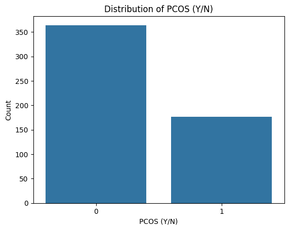
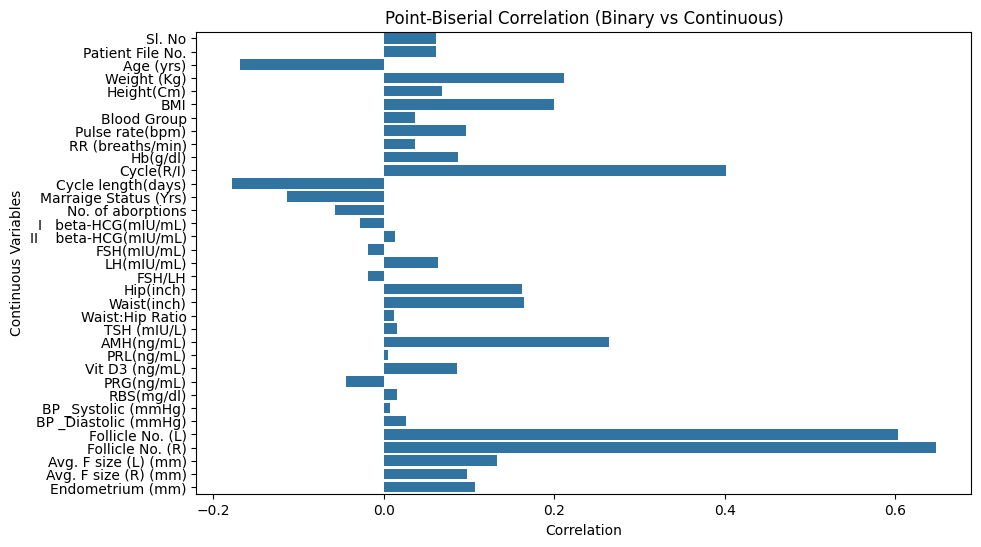
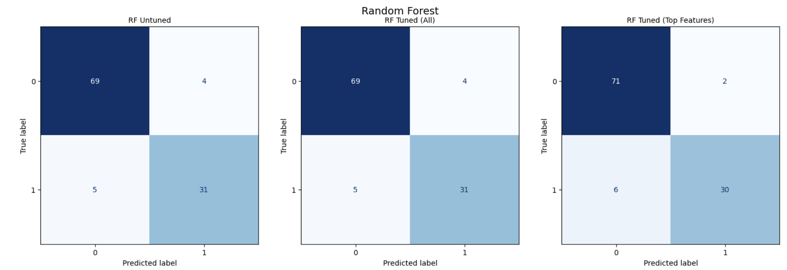
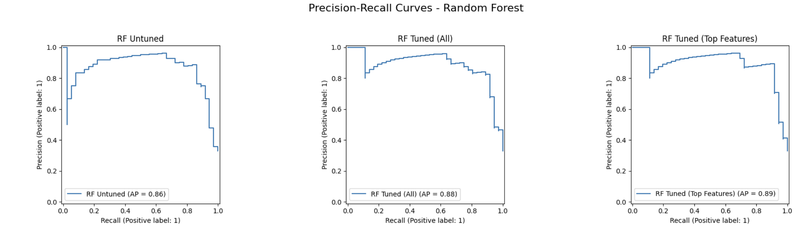
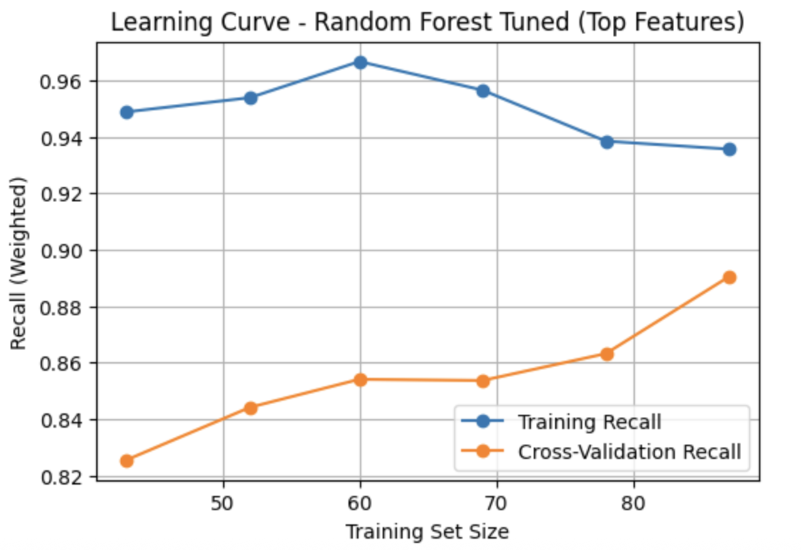

# 🧠 PCOS Detection Using Machine Learning

A supervised machine learning pipeline designed to predict the likelihood of **Polycystic Ovary Syndrome (PCOS)** based on clinical and lifestyle data. This project aims to support early detection and provide interpretable insights for medical professionals and researchers.

---

## 📊 Overview

- Cleaned and preprocessed the dataset (handled outliers, skewness, and missing values).
- Performed **feature selection** using:
  - Point-biserial correlation
  - Variance Inflation Factor (VIF)
- Trained and compared multiple models:
  - Logistic Regression
  - Decision Tree
  - Random Forest (best performance)
- Applied **SMOTE** to balance classes and reduce false negatives.
- Evaluated models using key metrics: recall, F1-score, and AUC-ROC.

---

## 🧪 Technologies Used

- **Programming Language:** Python
- **Libraries:** `pandas`, `matplotlib`, `seaborn`, `scikit-learn`, `imbalanced-learn (SMOTE)`
- **Environment:** Jupyter Notebook

---

## 📈 Exploratory Data Analysis (EDA)

A deep dive into the dataset was conducted to understand variable distributions, correlations, and potential imbalances in the target class.

| Plot                                              | Description                                                               |
| ------------------------------------------------- | ------------------------------------------------------------------------- |
|              | Correlation heatmap to identify relationships between numerical features. |
|  | Target class distribution showing imbalance in PCOS labels.               |

---

## 🔍 Feature Selection

| Plot                                                                | Description                                                                                                     |
| ------------------------------------------------------------------- | --------------------------------------------------------------------------------------------------------------- |
|  | Point-Biserial correlation heatmap used for selecting relevant features with respect to binary target variable. |

---

## 🤖 Model Performance

Detailed classification reports for top models using the most informative features:

| Model                   | Accuracy | Precision   | Recall      | F1-Score    | AUC-ROC  |
| ----------------------- | -------- | ----------- | ----------- | ----------- | -------- |
| **Random Forest**       | **0.93** | 0.95 / 0.89 | 0.95 / 0.89 | 0.95 / 0.89 | **0.89** |
| **Decision Tree**       | 0.91     | 0.92 / 0.88 | 0.95 / 0.83 | 0.93 / 0.86 | 0.85     |
| **Logistic Regression** | 0.94     | 0.95 / 0.91 | 0.96 / 0.89 | 0.95 / 0.90 | 0.83     |

> All models were tuned using the top features. Random Forest achieved the highest performance overall, especially in balancing precision and recall for both classes.

---

## 📌 Feature Importance (Random Forest)

| Plot                                                | Description                                                           |
| --------------------------------------------------- | --------------------------------------------------------------------- |
|  | Most influential features identified by the Random Forest classifier. |

---

## 📉 Model Diagnostics

| Plot                                                  | Description                                                                         |
| ----------------------------------------------------- | ----------------------------------------------------------------------------------- |
|  | Confusion matrix of the Random Forest classifier.                                   |
|                                  | Receiver Operating Characteristic (ROC) curve for evaluating classifier trade-offs. |
|        | Precision-Recall curve to evaluate performance under class imbalance.               |
|      | Learning curve showing model generalization and overfitting/underfitting trends.    |

## 📁 Project Structure

```
pcos-ml-detection/
│
├── data/
│ └── PCOS_data.csv
├── notebooks/
│ └── pcos_analysis.ipynb
├── plots/
│ ├── correlation.png
│ ├── feature-importance.png
│ └── ...
└── README.md
```

---

## 📌 Key Takeaways

- **Feature Selection** improved accuracy and interpretability by reducing noise.
- **Preprocessing** steps like outlier handling, skew correction, and SMOTE balanced the dataset.
- **Scaling** was essential for linear models to perform effectively.
- **Visualizations** (box plots, bar charts, pie charts) helped reveal data patterns clearly.
- **Hyperparameter Tuning** boosted performance, but required care to avoid overfitting.
- **Collaboration** was enhanced through clear notebook comments and task distribution.
- **Recall-Focused Evaluation** minimized false negatives—critical for medical predictions.

---

## 📝 Dataset

The dataset was sourced from Kaggle: [PCOS Dataset](<[https://www.kaggle.com/datasets/](https://www.kaggle.com/datasets/prasoonkottarathil/polycystic-ovary-syndrome-pcos)>)

---
